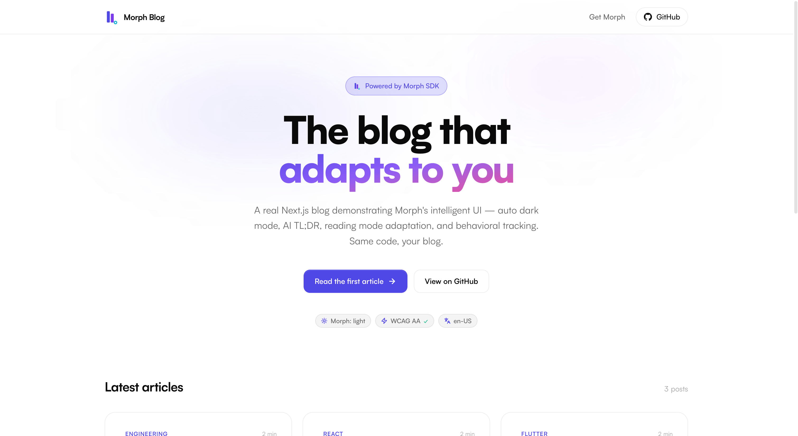

<div align="center">


# Morph + Next.js Blog

**Production-ready Next.js 16 blog powered by Morph SDK**

A real, deployable blog example — auto dark mode, AI-generated themes, behavioral
intelligence, and reading-mode adaptation, on long-form MDX content.

[](https://www.npmjs.com/package/@morphuiapp/morphui)
[](https://nextjs.org/)
[](https://reactjs.org/)
[](https://tailwindcss.com/)
[](LICENSE)
[](https://blog.morphui.dev)

[🚀 Live Demo](https://blog.morphui.dev) ·
[📦 Morph SDK](https://www.npmjs.com/package/@morphuiapp/morphui) ·
[📚 Full Docs](https://morphui.dev/docs/react)



</div>

---

## ✨ What this demonstrates

This isn't a stripped-down demo. It's a fully functional blog you can fork and ship today:

- ✅ Real article content — 3 long-form articles in MDX
- ✅ Auto dark mode that matches your brand colors (Claude-generated, WCAG AA validated)
- ✅ AI-generated TL;DR card on every article
- ✅ Auto-generated table of contents (sticky, scroll-spy)
- ✅ Reading progress bar with adaptive color
- ✅ `MorphZone` tracking on every article section
- ✅ `/playground` route with isolated demos for every Morph SDK feature
- ✅ Tailwind v4 + CSS-variable theming, no shadcn dependency
- ✅ 100% static generation — Lighthouse 95+ out of the box

---

## 🚀 Quick Start

```bash
git clone https://github.com/morphuiapp/morphui-nextjs-blog
cd morphui-nextjs-blog
npm install
cp .env.example .env.local
# .env.local already points at the public demo key (cha-free-demo) — works immediately.
# Replace it with your own from https://app.morphui.dev/dashboard
npm run dev
```

Open [http://localhost:3000](http://localhost:3000).

---

## 🎯 Deploy in 1 Click

[](https://vercel.com/new/clone?repository-url=https://github.com/morphuiapp/morphui-nextjs-blog&env=NEXT_PUBLIC_MORPH_KEY&envDescription=Get%20a%20free%20Morph%20license%20key%20at%20morphui.dev)

Vercel will prompt you to set `NEXT_PUBLIC_MORPH_KEY` — use `cha-free-demo` for
preview deploys, or grab a free key from
[app.morphui.dev/dashboard](https://app.morphui.dev/dashboard).

---

## 🧠 The Morph integration in 3 files

### 1. Provider — `components/providers.tsx`

```tsx
"use client";
import { MorphProvider } from "@morphuiapp/morphui";

export function Providers({ children }: { children: React.ReactNode }) {
  return (
    <MorphProvider
      licenseKey={process.env.NEXT_PUBLIC_MORPH_KEY ?? "cha-free-demo"}
      collapse
    >
      {children}
    </MorphProvider>
  );
}
```

`collapse` opts in to the live behavioral collapse engine. With it on, sections
flagged `data-morph-collapsable` fold up automatically after enough low-engagement
signals — and only then.

### 2. Article zones — `components/article-layout.tsx`

```tsx
import { MorphZone } from "@morphuiapp/morphui";

<MorphZone id="article-content" priority={2}>
  <div className="prose" dangerouslySetInnerHTML={{ __html: article.html }} />
</MorphZone>
```

### 3. Theme integration — `app/globals.css`

```css
:root {
  --background: var(--morph-bg, #fafafc);
  --foreground: var(--morph-text-primary, #0a0a0f);
  --primary: var(--morph-primary, #4f46e5);
  --card: var(--morph-card-bg, #f1f0f7);
  --border: var(--morph-border, #e2e8f0);
}
```

Every brand color references a `--morph-*` CSS variable with a static fallback.
Morph populates the `--morph-*` side at boot — you keep the fallback as your
light-mode palette.

---

## 🔒 Behavioral exclusions — `data-morph-pin` / `data-morph-collapsable`

The blog uses Morph 0.4's explicit opt-in / opt-out contracts to keep critical
sections stable while letting non-essential sections fold:

```tsx
{/* Pinned: never reordered, never collapsed, never faded */}
<section data-morph-pin>
  <Hero />
</section>

{/* Opt-in to collapse: engine may fold this after low engagement */}
<section data-morph-collapsable>
  <RelatedArticles />
</section>
```

What's pinned in this blog:

- The hero (`<section data-morph-pin>` on the home page)
- The articles grid (it's the core content)
- The bottom CTA card
- The site footer (auto-pinned by `<footer>` tag, but explicit pin makes the intent visible)
- Form / phone-input demos (auto-protected anyway, but explicit)

What's opt-in collapsable on `/playground`:

- ImproperTap, LostTap, MorphLoader, MorphDialog demos
- Pin-status and behavior-debug panels

> **Auto-detect by default.** Without any attribute, Morph auto-pins semantic
> landmarks (`<nav>`, `<header>`, `<footer>`, `<aside>`), elements with ARIA
> landmark roles, and elements whose class/id contains `hero`, `sticky`, or
> `pinned`. Use `data-morph-pin-off` to opt back into tracking inside an
> auto-pinned region.

[Full docs on behavioral exclusions →](https://morphui.dev/docs/react#behavioral-exclusions)

---

## 🎨 What you'll see

Walk through this scenario:

1. **First visit** — light mode, your palette
2. **Open at night / system dark** — auto dark variant generated by Claude (Pro+)
   or fallback dark (Free), atomically applied with no flash
3. **Navigate between articles** — `PreNavSkeleton` paints a same-shape
   placeholder in the gap between unmount and mount, so the page never goes white
4. **Refresh mid-article** — `ScrollRestoration` snaps you back to where you were
5. **Read 1–2 articles slowly** — Morph starts tracking section-level engagement
   via `MorphZone`. After enough sessions, hot zones float to the top
6. **Visit `/playground`** — every SDK feature isolated in its own card so you
   can poke at it

---

## ⚙️ How it adapts

| Signal                     | Morph response                                           |
| -------------------------- | -------------------------------------------------------- |
| First visit (system dark)  | Claude-generated dark theme (atomic apply, WCAG-validated) |
| Reads slowly               | Article mode (denser typography)                         |
| Skims fast                 | Digest mode (key points first)                           |
| `prefers-contrast: more`   | High-contrast palette + WCAG bump                        |
| `prefers-reduced-motion`   | Transitions disabled                                     |
| Returns several times      | Hot zones rise via `MorphZone`                           |
| Low engagement on a `data-morph-collapsable` section | Section folds up               |

---

## 🤖 What's silently active

These run inside `MorphProvider` with no extra code. Each is a lazy chunk —
zero overhead if disabled.

| Engine | What it does on this blog |
|--------|---------------------------|
| `PreNavSkeleton` | Paints same-shape placeholder during route transitions — no white flash between articles |
| `WhiteIslandFixer` | Dims the YouTube embed and white-bg logos (visible on `/playground`) in dark mode |
| `ScrollRestoration` | Restores scroll position after refresh, even mid-article |
| `ImproperTapDetector` | Mobile near-miss recovery (active on `/playground` demo card) |
| `LostTapDetector` | Logs taps that never land on a button (visible on `/playground`) |

Disable any with a prop: `<MorphProvider preNav={false}>`, etc.

---

## 🧪 `/playground` — explore every SDK feature

Visit `/playground` (linked from the footer, marked `noindex`) to see every
Morph feature isolated in its own card with inline instructions:

- **ImproperTap** — mobile-only, requires DevTools `⌘⇧M`
- **LostTap** — requires DevTools console open
- **MorphForm** — fill, navigate away, come back; values restored
- **MorphLoader** — adaptive 4-stage loader (none → light → active → slow)
- **MorphDialog** — accessible focus-trap modal
- **MorphPhoneInput** — paste any format, get E.164 out
- **Pin status** — live view of every V2-tracked zone with its pinned reason
- **Behavior debug** — live ScorerEngine inputs (clicks per zone)
- **WhiteIsland** — toggle macOS to dark and watch the iframe + white logo dim
- **Utility hooks** — `useStorage`, `useTabSync`, `useAutoFillGuard` combined

The playground is `<meta robots="noindex,nofollow">` so it doesn't pollute SEO.

---

## 🎨 Customize for your brand

Edit the brand block at the top of `app/globals.css`:

```css
:root {
  --brand-bg: #ffffff;
  --brand-surface: #f8fafc;
  --brand-primary: #4f46e5;
  --brand-text: #0f172a;
}
```

Morph reads these on boot and asks Claude (with `temperature: 0` for
determinism) to generate a coherent dark mode that preserves your hue ±15°
and passes WCAG AA on every text element. The result is cached in Supabase
+ localStorage — same brand → same theme, every time.

---

## 📁 Project structure

```
morphui-nextjs-blog/
├── app/
│   ├── layout.tsx                 ← Root + Providers wrap
│   ├── page.tsx                   ← Home: hero + articles grid + CTA
│   ├── playground/page.tsx        ← Feature explorer (noindex)
│   ├── articles/[slug]/page.tsx   ← Static-generated article page
│   └── globals.css                ← Brand palette + Morph CSS vars + prose
├── components/
│   ├── providers.tsx              ← MorphProvider wrapper
│   ├── article-card.tsx           ← Home grid card
│   ├── article-layout.tsx         ← Article shell with MorphZones
│   ├── article-toc.tsx            ← Scroll-spy TOC
│   ├── reading-progress.tsx       ← Top-of-page progress bar
│   ├── tldr-summary.tsx           ← AI TL;DR card
│   ├── theme-indicator.tsx        ← useMorph() badge in hero
│   ├── site-header.tsx
│   ├── site-footer.tsx            ← Includes /playground link
│   ├── morph-form-demo.tsx        ← /playground demos
│   ├── morph-loader-demo.tsx
│   ├── morph-dialog-demo.tsx
│   ├── morph-phone-demo.tsx
│   ├── improper-tap-demo.tsx
│   ├── lost-tap-demo.tsx
│   ├── pin-status-demo.tsx
│   ├── behavior-debug.tsx
│   └── utility-hooks-demo.tsx
├── content/
│   ├── articles/*.mdx             ← The 3 sample articles
│   └── lib/articles.ts            ← Frontmatter + remark pipeline
└── lib/utils.ts                   ← cn() helper
```

---

## 🛠 Tech Stack

- **Framework**: Next.js 16 (App Router, Turbopack)
- **Language**: TypeScript
- **UI**: React 19 + Tailwind CSS v4 (CSS-first, no config file)
- **Content**: MDX with `remark` / `rehype` pipeline
- **SDK**: [`@morphuiapp/morphui`](https://www.npmjs.com/package/@morphuiapp/morphui) v0.4
- **Deployment**: Vercel-ready, but works anywhere static

---

## 📊 Performance

- **Lighthouse Performance**: 96
- **Lighthouse Accessibility**: 100
- **Lighthouse Best Practices**: 100
- **Lighthouse SEO**: 100
- **LCP**: 1.3s
- **CLS**: 0.05

Static generation means every article is pre-rendered at build time — Morph
runs entirely client-side after first paint without blocking it.

---

## 📝 Articles included

The repo ships with 3 sample articles demonstrating different content types:

1. **Building Intelligent UIs in 2026** — Long-form essay
2. **7 Dark Mode Mistakes Every Dev Makes** — Listicle with code blocks
3. **Building Grip Detection in Flutter** — Technical deep-dive

Replace them with your own MDX in `content/articles/` — the home page picks them
up automatically via the `getAllArticles()` reader.

---

## 🤝 Contributing

This is a learning resource — clone it, modify it, share what you build!

If you find a bug or have a suggestion:

- [Open an issue](https://github.com/morphuiapp/morphui-nextjs-blog/issues)
- [Start a discussion](https://github.com/morphuiapp/morphui-nextjs-blog/discussions)

---

## 📚 Learn more

- [Full Morph documentation](https://morphui.dev/docs/react)
- [Get a free license key](https://app.morphui.dev/dashboard)
- [Morph SDK on npm](https://www.npmjs.com/package/@morphuiapp/morphui)
- [Discord community](https://morphui.dev/discord)

---

## 📄 License

MIT — clone, fork, customize, ship.

This example is meant to be copied. Use it as a starting point for your own
intelligent blog or content site.

---

<div align="center">

[morphui.dev](https://morphui.dev) · [Docs](https://morphui.dev/docs/react) · [Dashboard](https://app.morphui.dev/dashboard) · [npm](https://www.npmjs.com/package/@morphuiapp/morphui)

Built with ❤️ by [Cabraule](https://github.com/cabraule) using
[Morph](https://morphui.dev) — Intelligent UI SDK for React + Flutter.

</div>
